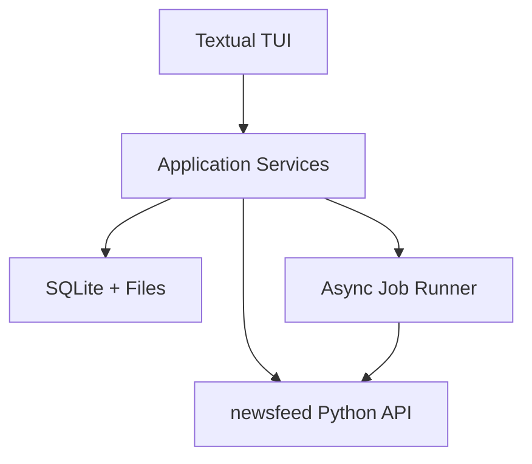

# NewsFeed Terminal PRD

状态：Draft  
日期：2026-06-23  
目标版本：v0.1 到 v1.0  
产品方向：基于 `Cyclododecene/newsfeed` 的 Bloomberg-like 新闻情报 TUI

## 1. Summary

NewsFeed Terminal 是一个面向投资研究、宏观观察和新闻情报分析的终端式 TUI 产品。它基于 `Cyclododecene/newsfeed` 已有的 GDELT 查询、全文下载、缓存、异步下载和增量更新能力，提供一个命令优先、多面板、可定制的新闻监控工作台。

一句话定义：

> NewsFeed Terminal 用 Bloomberg Terminal 式的命令和工作区体验，把全球新闻、事件、主题、地理、趋势和用户关注列表组织成一个可搜索、可告警、可追踪的本地新闻情报终端。

本产品第一阶段不追求完整金融数据终端，也不复制 Bloomberg 的专有数据、交易、通讯和合规生态。第一阶段的核心是：

- 新闻流
- 命令式搜索
- Watchlist
- 全文阅读
- 趋势和地理视图
- 告警
- 本地缓存和增量刷新
- 可导出的研究简报

## 2. Background

### 2.1 基础项目

`Cyclododecene/newsfeed` 是一个基于 GDELT Project 的 Python 新闻数据工具。当前能力包括：

- GDELT DOC 2.0 API article、timeline、geo 查询。
- GDELT EVENT、GKG、MENTIONS 数据库查询。
- GDELT V1、V2 数据支持。
- 单篇或批量全文下载。
- 查询后自动下载全文。
- 缓存、异步下载、增量查询、Parquet 压缩。
- CLI 和 Python API。

这些能力非常适合作为新闻情报终端的数据底座。TUI 需要补上的不是底层抓取能力，而是：

- 操作体验。
- 信息组织。
- 实时/准实时刷新。
- 关注列表。
- 告警规则。
- 新闻重要性排序。
- 研究工作流。

### 2.2 竞品启发

| 产品 | 典型能力 | 对 NewsFeed Terminal 的启发 |
|---|---|---|
| Bloomberg Terminal | 实时新闻、TOP、First Word、Daybreak、Morning Report、新闻告警、新闻趋势、图表和证券联动、命令 mnemonic | 使用短命令和多面板工作区；新闻需要和主题、标的、事件、趋势联动 |
| LSEG Workspace / Reuters | 实时新闻、多源新闻、NLP tagging、portfolio/watchlist、研究和分析工作流、跨平台 alerts | 将新闻结构化为实体、主题、国家、来源、情绪和时间序列 |
| FactSet Workstation | 市场数据、研究、图表、筛选、告警、AI 搜索和研究助手 | 将搜索、筛选、告警和摘要变成研究闭环 |
| Koyfin | 市场 dashboard、watchlist、charts、screener、news、alerts | 先做轻量 watchlist news，再逐步接入市场数据 |
| TradingView / Yahoo Finance | Watchlist、图表、筛选器、价格和新闻告警、个性化新闻 | 用低成本方式实现个人关注资产和主题的监控 |
| OpenBB | 开源金融数据平台、多数据源接入、REST API、Python/Excel/Workspace/AI agent 复用 | 架构上保留 connector 层，未来可接 OpenBB、yfinance 或自有数据 |

## 3. Product Thesis

成熟金融终端的核心壁垒并不是单个新闻列表，而是：

```text
news + entities + watchlists + alerts + charts + command system + workspace
```

NewsFeed Terminal 的核心 thesis：

```text
User thinks in commands.
Terminal keeps a live workspace.
News becomes structured intelligence.
Watchlists define relevance.
Alerts preserve attention.
Briefings turn feeds into decisions.
```

## 4. Goals

### 4.1 Product Goals

1. 提供一个 Bloomberg-like 的命令式 TUI 体验。
2. 让用户能快速查询全球新闻、主题、国家、来源和时间范围。
3. 支持 Watchlist，将用户关心的公司、关键词、国家、行业、主题置顶。
4. 支持全文阅读和原文链接追踪。
5. 支持 timeline volume、tone、language、source country 等趋势视图。
6. 支持 geo 查询和国家/地区分布视图。
7. 支持本地告警规则，提醒新新闻、突发主题、热度变化或情绪变化。
8. 支持自动生成晨报、快报、watchlist briefing。
9. 支持本地缓存、增量刷新和历史查询。
10. 支持导出 Markdown、CSV、JSON、Parquet。

### 4.2 Engineering Goals

1. 最大化复用 `newsfeed` 现有 Python API 和 CLI 能力。
2. 使用清晰的 service layer 包装数据查询、全文下载、缓存和告警。
3. 使用异步任务模型支持刷新、下载和告警扫描。
4. 使用 SQLite 管理用户配置、watchlist、alerts、workspaces 和阅读状态。
5. 使用 Parquet 或 CSV 管理大规模查询结果和历史归档。
6. TUI 层和数据层解耦，未来可以复用后端支持 Web、API 或 agent。
7. 允许后续接入金融价格数据，但不让市场数据阻塞新闻 MVP。

## 5. Non-Goals

v0.1 到 v0.3 不做：

- 真实交易执行。
- 订单管理系统。
- 专业级实时行情分发。
- Bloomberg、Reuters、FactSet 等专有数据复制。
- 即时通讯、聊天网络或客户消息系统。
- 团队协作和企业权限。
- 复杂因子研究、回测、组合优化。
- 移动端。
- Web UI。
- 对所有新闻做可靠投资建议。

## 6. Target Users

### 6.1 个人投资研究者

需要：

- 追踪股票、行业、国家、宏观主题相关新闻。
- 快速知道过去几小时发生了什么。
- 查看某个主题的新闻量和情绪变化。
- 为投资笔记导出新闻摘要。

### 6.2 宏观和地缘政治观察者

需要：

- 按国家、主题、时间追踪事件。
- 查看某个关键词在不同地区的新闻分布。
- 关注冲突、政策、供应链、能源、货币和贸易新闻。

### 6.3 研究员 / Analyst

需要：

- 快速做 morning briefing。
- 追踪 watchlist 中公司和主题的新闻。
- 保存重要新闻和全文。
- 导出带来源的 Markdown brief。

### 6.4 开源工具用户 / Developer

需要：

- 通过命令行和 TUI 使用 GDELT 数据。
- 管理缓存和增量更新。
- 编写自定义 connector、ranking、alert rule。

## 7. UX Principles

1. 命令优先：核心操作应能通过短命令完成。
2. 多面板：同屏展示新闻流、详情、watchlist、趋势。
3. 可打断：查询、下载、刷新不阻塞界面。
4. 可追踪：每条新闻都能看到来源、时间、URL、查询条件。
5. 可定制：用户可以保存 workspace、watchlist、alert。
6. 少解释，多操作：TUI 不写冗长说明，靠状态栏、快捷键和 help view 引导。
7. 渐进增强：没有市场数据也能成立；有价格数据时做联动。

## 8. Information Architecture

### 8.1 Main Layout

```text
+--------------------------------------------------------------------------------+
| NEWSFEED TERMINAL | workspace: global-macro | refresh: 5m | alerts: 3 | cache ok |
+--------------------+------------------------------------------+----------------+
| Watchlists         | News Feed                                | Detail         |
| - Markets          | 15:04  US CPI rises...                   | Headline       |
| - China Tech       | 15:01  Oil extends gains...              | Source         |
| - FX               | 14:57  ECB signals...                    | Entities       |
| - Energy           | 14:52  TSMC supplier...                  | Tone           |
|                    |                                          | Related        |
+--------------------+------------------------------------------+----------------+
| Timeline / Geo / Alerts / Command History                                      |
+--------------------------------------------------------------------------------+
| > NEWS "Exchange Rate" COUNTRY:US,CHINA SINCE:24h <GO>                         |
+--------------------------------------------------------------------------------+
```

### 8.2 Primary Views

| View | 用途 |
|---|---|
| Home | 默认市场和新闻概览 |
| Top News | 重要新闻流 |
| Search Results | 查询结果 |
| Article Reader | 全文阅读、摘要、来源 |
| Timeline | 新闻量、tone、语言、来源国家趋势 |
| Geo | 国家/地区分布 |
| Watchlist | 关注项管理和 watchlist news |
| Alerts | 告警规则、命中记录、静音 |
| Briefing | 晨报、快报、watchlist report |
| Cache | 缓存、增量历史、存储状态 |
| Help | 命令和快捷键 |

## 9. Command System

### 9.1 Command Style

命令参考 Bloomberg mnemonic 风格，使用短词和参数。

```text
TOP <GO>
NEWS AAPL <GO>
NEWS "Exchange Rate" COUNTRY:US,CHINA SINCE:24h <GO>
TL OIL MODE:tone SINCE:7d <GO>
GEO "supply chain" SINCE:30d <GO>
WATCH ADD "TSMC" TYPE:company <GO>
ALRT ADD QUERY:"Taiwan semiconductor" FREQ:5m <GO>
BRIEF WATCHLIST:Markets SINCE:12h <GO>
READ 12 <GO>
EXPORT BRIEF FORMAT:md <GO>
```

### 9.2 MVP Commands

| Command | 含义 | MVP |
|---|---|---|
| `TOP` | 查看当前重要新闻 | P0 |
| `NEWS` | 查询新闻 | P0 |
| `READ` | 打开新闻详情或全文 | P0 |
| `TL` | 查看 timeline | P0 |
| `GEO` | 查看地理分布 | P1 |
| `WATCH` | 管理 watchlist | P0 |
| `ALRT` | 管理告警 | P1 |
| `BRIEF` | 生成简报 | P1 |
| `SRC` | 来源过滤和来源统计 | P1 |
| `SAVE` | 保存当前 workspace 或 query | P1 |
| `EXPORT` | 导出结果 | P0 |
| `CACHE` | 查看或清理缓存 | P1 |
| `HELP` | 命令帮助 | P0 |
| `QUIT` | 退出 | P0 |

### 9.3 Keyboard Shortcuts

| 快捷键 | 行为 |
|---|---|
| `/` | 聚焦搜索/命令输入 |
| `Enter` | 打开当前选中新闻 |
| `Esc` | 返回上一级或关闭弹窗 |
| `j/k` | 上下移动 |
| `h/l` | 左右面板移动 |
| `r` | 刷新当前视图 |
| `s` | 保存当前新闻 |
| `a` | 基于当前查询创建告警 |
| `w` | 添加当前实体到 watchlist |
| `b` | 生成 brief |
| `?` | 打开 help |

## 10. Functional Requirements

### 10.1 News Query

| ID | Requirement | Priority |
|---|---|---|
| NQ-001 | 用户可以通过关键词查询 GDELT article list | P0 |
| NQ-002 | 用户可以设置 start/end 或 since 时间范围 | P0 |
| NQ-003 | 用户可以按国家过滤 | P0 |
| NQ-004 | 用户可以按语言过滤 | P1 |
| NQ-005 | 用户可以按来源域名过滤 | P1 |
| NQ-006 | 查询结果展示 headline、source、time、url、country、tone | P0 |
| NQ-007 | 查询可以后台执行并显示 loading/error/empty 状态 | P0 |
| NQ-008 | 查询结果可以排序：时间、tone、来源数、相关性 | P1 |
| NQ-009 | 查询可以保存为 named query | P1 |

### 10.2 Top News

| ID | Requirement | Priority |
|---|---|---|
| TN-001 | `TOP` 展示默认新闻概览 | P0 |
| TN-002 | 默认时间范围为最近 6 小时，可配置 | P0 |
| TN-003 | Top News 排序综合时间、新鲜度、来源、watchlist 命中 | P0 |
| TN-004 | 支持按 workspace profile 设置 Top News 查询模板 | P1 |
| TN-005 | 支持置顶 breaking 或 high-alert 新闻 | P1 |

### 10.3 Article Reader

| ID | Requirement | Priority |
|---|---|---|
| AR-001 | 用户可以打开新闻详情 | P0 |
| AR-002 | 详情展示 headline、source、published time、url、query context | P0 |
| AR-003 | 支持调用 fulltext downloader 获取全文 | P0 |
| AR-004 | 全文下载失败时展示可理解错误和原始 URL | P0 |
| AR-005 | 支持保存文章到 local library | P1 |
| AR-006 | 支持复制 citation 或导出 Markdown snippet | P1 |

### 10.4 Timeline

| ID | Requirement | Priority |
|---|---|---|
| TL-001 | 支持 timeline volume 查询 | P0 |
| TL-002 | 支持 timeline tone 查询 | P1 |
| TL-003 | 支持 timeline language 查询 | P1 |
| TL-004 | 支持 timeline source country 查询 | P1 |
| TL-005 | TUI 中用 sparkline 或表格展示趋势 | P0 |
| TL-006 | 用户可以从 timeline 中跳转到对应时间段新闻 | P1 |

### 10.5 Geo

| ID | Requirement | Priority |
|---|---|---|
| GEO-001 | 支持 geo 查询 | P1 |
| GEO-002 | 按国家/地区展示数量和占比 | P1 |
| GEO-003 | 支持从国家行 drill down 到新闻列表 | P1 |
| GEO-004 | 支持按 watchlist 生成地理分布 | P2 |

### 10.6 Watchlist

| ID | Requirement | Priority |
|---|---|---|
| WL-001 | 用户可以创建多个 watchlist | P0 |
| WL-002 | watchlist item 支持 keyword、company、country、theme、source | P0 |
| WL-003 | 用户可以添加、删除、禁用 watchlist item | P0 |
| WL-004 | News Feed 中高亮 watchlist 命中 | P0 |
| WL-005 | `WATCH NEWS` 展示当前 watchlist 新闻 | P0 |
| WL-006 | 支持 watchlist import/export | P1 |
| WL-007 | 支持为 watchlist 设置刷新频率 | P1 |

### 10.7 Alerts

| ID | Requirement | Priority |
|---|---|---|
| AL-001 | 用户可以基于 query 创建告警 | P1 |
| AL-002 | 告警规则支持关键词、国家、来源、tone 阈值、频率 | P1 |
| AL-003 | 告警扫描后台运行 | P1 |
| AL-004 | 命中记录保存在 SQLite | P1 |
| AL-005 | TUI 状态栏显示未读告警数 | P1 |
| AL-006 | 支持静音、删除、暂停、恢复告警 | P1 |
| AL-007 | 支持 desktop notification 或 webhook | P2 |

### 10.8 Briefing

| ID | Requirement | Priority |
|---|---|---|
| BF-001 | 支持基于当前查询生成 brief | P1 |
| BF-002 | 支持基于 watchlist 生成 brief | P1 |
| BF-003 | brief 包含 key headlines、themes、notable changes、links | P1 |
| BF-004 | brief 明确区分原始新闻事实和系统推断 | P1 |
| BF-005 | 支持导出 Markdown | P1 |
| BF-006 | 支持接入 LLM 生成更自然摘要 | P2 |

### 10.9 Export

| ID | Requirement | Priority |
|---|---|---|
| EX-001 | 查询结果可导出 CSV | P0 |
| EX-002 | 查询结果可导出 JSON | P0 |
| EX-003 | 查询结果可导出 Parquet | P1 |
| EX-004 | brief 可导出 Markdown | P1 |
| EX-005 | 导出记录保存在历史中 | P2 |

### 10.10 Cache and Performance

| ID | Requirement | Priority |
|---|---|---|
| CP-001 | 支持启用 `newsfeed` cache | P0 |
| CP-002 | 支持 async download/query | P0 |
| CP-003 | 支持 incremental query | P1 |
| CP-004 | `CACHE` view 展示缓存大小、文件数、历史查询数 | P1 |
| CP-005 | 支持清理过期缓存 | P1 |
| CP-006 | 长查询必须可取消 | P1 |

## 11. Data Model

### 11.1 SQLite Tables

| Table | Description |
|---|---|
| `workspaces` | 用户工作区配置 |
| `workspace_layouts` | TUI 面板布局和默认视图 |
| `queries` | 保存的查询 |
| `query_runs` | 查询执行历史 |
| `articles` | 已见过的文章 metadata |
| `article_fulltexts` | 已下载全文索引和存储路径 |
| `watchlists` | 关注列表 |
| `watchlist_items` | 关注项 |
| `alerts` | 告警规则 |
| `alert_hits` | 告警命中 |
| `briefings` | 生成的 brief |
| `exports` | 导出历史 |
| `settings` | 用户设置 |

### 11.2 Article Fields

| Field | Description |
|---|---|
| `id` | 本地 ID |
| `gdelt_url` | GDELT 或原始 URL |
| `source_url` | 新闻原文 URL |
| `title` | 标题 |
| `source_name` | 来源 |
| `source_domain` | 来源域名 |
| `published_at` | 发布时间 |
| `language` | 语言 |
| `country` | 国家 |
| `tone` | GDELT tone |
| `themes` | GDELT themes |
| `entities` | 抽取实体 |
| `watchlist_hits` | 命中的 watchlist items |
| `first_seen_at` | 本地首次看到时间 |
| `last_seen_at` | 本地最后看到时间 |
| `fulltext_status` | none, pending, success, failed |

## 12. System Architecture



### 12.1 Components

| Component | Responsibility |
|---|---|
| `tui` | Textual app、views、widgets、commands、keybindings |
| `commands` | 命令解析、参数校验、command registry |
| `services.query` | article/timeline/geo/db query 包装 |
| `services.fulltext` | 全文下载、批量下载、失败重试 |
| `services.watchlist` | watchlist CRUD、命中计算 |
| `services.alerts` | alert rule、扫描、命中、未读状态 |
| `services.briefing` | brief 生成、导出 |
| `services.cache` | cache stats、清理、增量历史 |
| `storage` | SQLite schema、repositories、migration |
| `connectors` | newsfeed、future market data、future OpenBB |

### 12.2 Recommended Stack

| Layer | Recommendation |
|---|---|
| Language | Python 3.11+ |
| TUI | Textual |
| Dataframe | pandas |
| Storage | SQLite + local files |
| Large result | Parquet |
| Async | asyncio + Textual workers |
| CLI | Typer or argparse |
| Tests | pytest |
| Packaging | uv or pixi, later pipx/Homebrew |

## 13. Ranking Model

MVP 使用可解释的 heuristic ranking。

```text
score =
  recency_score
  + source_diversity_score
  + watchlist_match_score
  + query_relevance_score
  + tone_extremity_score
  + duplicate_penalty
```

| Signal | Description |
|---|---|
| Recency | 越新越高 |
| Source diversity | 多来源报道更高 |
| Watchlist match | 命中用户关注项更高 |
| Query relevance | 标题、主题、实体匹配更高 |
| Tone extremity | 正负 tone 极端值可提示风险 |
| Duplicate penalty | 相似标题或相同 URL 降权 |

P2 可引入 embedding、LLM relevance 或 clustering。

## 14. Alert Rules

### 14.1 Rule Examples

```yaml
name: China FX Watch
query: exchange rate yuan dollar
countries: [CH, US]
since: 30m
frequency: 5m
threshold:
  min_new_articles: 3
  tone_below: -4
```

```yaml
name: TSMC Supply Chain
query: TSMC supplier disruption
watchlist: Semiconductors
frequency: 10m
threshold:
  min_new_articles: 1
```

### 14.2 Alert States

| State | Meaning |
|---|---|
| active | 正常扫描 |
| paused | 用户暂停 |
| muted | 命中但不提示 |
| failed | 最近扫描失败 |
| deleted | 软删除 |

## 15. Briefing Format

默认 brief 结构：

```markdown
# Briefing: Markets Watch

Time window: Last 12h
Generated at: 2026-06-23 16:00 Europe/Dublin

## Key Headlines

1. ...
2. ...

## Watchlist Hits

| Item | Headlines | Tone | Sources |
|---|---:|---:|---:|

## Notable Trends

- News volume increased for ...
- Negative tone concentrated around ...

## Source Links

- [Headline](...)
```

如果接入 LLM，必须保留原始 headline 和 URL，不能生成无法追溯的结论。

## 16. MVP Scope

### 16.1 v0.1

目标：可用的本地新闻查询 TUI。

包含：

- Textual TUI skeleton。
- `TOP`、`NEWS`、`READ`、`TL`、`EXPORT`、`HELP`。
- article search。
- timeline volume。
- fulltext download。
- CSV/JSON export。
- basic cache 开关。
- loading、empty、error states。

验收：

- 用户可以启动 TUI。
- 用户可以执行 `NEWS "oil" SINCE:24h`。
- 用户可以打开一条新闻详情。
- 用户可以下载全文。
- 用户可以导出查询结果。
- 失败时界面不崩溃。

### 16.2 v0.2

目标：watchlist-first 新闻工作区。

包含：

- SQLite storage。
- Watchlist CRUD。
- Watchlist hits。
- `WATCH NEWS`。
- 保存 query。
- workspace config。
- query history。
- Top News ranking v1。

验收：

- 用户可以创建 `Markets` watchlist。
- 新查询结果能高亮 watchlist 命中。
- 重启后 watchlist 和 query history 保留。

### 16.3 v0.3

目标：告警和简报。

包含：

- Alert rule CRUD。
- Background scan。
- Alert hit inbox。
- `BRIEF` Markdown export。
- geo view。
- timeline tone。
- cache management view。

验收：

- 用户可以基于查询创建 alert。
- Alert 命中后状态栏显示未读数。
- 用户可以生成 watchlist brief 并导出 Markdown。

### 16.4 v1.0

目标：稳定的个人新闻情报终端。

包含：

- 多 workspace。
- 完整 command help。
- 稳定 ranking。
- 导入/导出配置。
- Parquet history。
- LLM briefing 可选。
- OpenBB/yfinance connector 可选。
- pipx 安装或独立包。

## 17. Success Metrics

### 17.1 Product Metrics

| Metric | Target |
|---|---|
| Time to first useful query | < 2 minutes |
| TUI cold start | < 2 seconds |
| Basic query feedback | < 1 second 显示 loading |
| Watchlist setup | < 5 minutes |
| Brief generation | < 30 seconds for 100 articles |
| Query export success | > 99% |

### 17.2 Quality Metrics

| Metric | Target |
|---|---|
| TUI crash-free sessions | > 99% |
| Failed fulltext download visible error | 100% |
| Command parse error has suggestion | > 90% common cases |
| Saved watchlist persistence | 100% |
| Tests for command parser | > 80% branch coverage |

## 18. Risks and Mitigations

| Risk | Impact | Mitigation |
|---|---|---|
| GDELT data latency or API instability | 查询失败或结果延迟 | cache、retry、clear error state、fallback to database query |
| Fulltext extraction unreliable | 阅读体验不稳定 | 保留原文 URL、展示 partial text、失败重试 |
| Bloomberg-like 范围过大 | MVP 失焦 | 明确第一阶段只做新闻情报终端 |
| TUI 性能问题 | 大结果卡顿 | 分页、虚拟列表、后台 worker、限制默认结果数 |
| 告警噪音太多 | 用户疲劳 | 阈值、静音、去重、digest |
| 许可证不清 | 发布风险 | 在发布前确认 repo README 和 setup.py license 差异 |
| 金融数据接入复杂 | 延期风险 | v1 前只保留 connector 设计，不作为 MVP blocker |

## 19. Open Questions

1. 产品名称是否使用 `NewsFeed Terminal`，还是另起品牌名？
2. 第一版是否只支持英文新闻，还是需要中文/多语言界面？
3. Watchlist 中的 company 是否需要 ticker/entity mapping？
4. 是否需要接入价格数据？如果需要，优先 yfinance、OpenBB 还是用户自带 CSV/API？
5. Briefing 是否默认接入 LLM，还是作为可选插件？
6. 告警是只在 TUI 内提示，还是需要系统通知/webhook？
7. 是否需要保留所有历史查询，还是默认只保存用户收藏和告警命中？

## 20. Source Notes

本 PRD 的调研参考：

- [Cyclododecene/newsfeed GitHub](https://github.com/Cyclododecene/newsfeed)
- [Bloomberg Terminal News](https://professional.bloomberg.com/products/bloomberg-terminal/news/)
- [Bloomberg Professional App](https://professional.bloomberg.com/products/bloomberg-terminal/access/bloomberg-professional-app/)
- [LSEG Workspace](https://www.lseg.com/en/data-analytics/products/workspace)
- [LSEG News Services](https://developers.lseg.com/en/product/news/workspace_news)
- [FactSet Workstation](https://www.factset.com/marketplace/catalog/product/factset-workstation)
- [Koyfin Market Dashboards](https://www.koyfin.com/features/market-dashboards/)
- [TradingView Watchlist Alerts](https://www.tradingview.com/support/solutions/43000739708-watchlist-alerts-your-trading-edge/)
- [OpenBB GitHub](https://github.com/OpenBB-finance/OpenBB)

